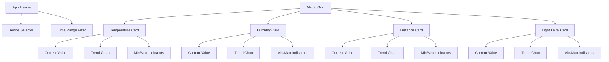
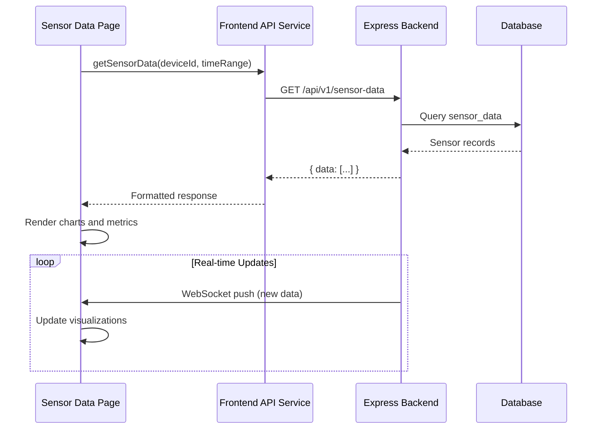

# Sensor Data Visualization Page Specification

## Overview
This document outlines the specifications for the sensor data visualization page in the IoT frontend application. The page will display real-time and historical sensor data with intuitive visualizations and a professional UI.

## Screen Layout

## Components

### 1. Header Section
- App title: "Sensor Dashboard"
- Device selector dropdown (default: "esp32-sensor-1")
- Time range filter (1h, 24h, 7d, custom)

### 2. Metric Cards (4 cards - 2x2 grid)
Each card contains:
- Title (e.g., "Temperature")
- Current value (large font)
- Trend indicator (▲/▼ with percentage change)
- Line chart (last 20 data points)
- Min/max values for selected time range
- Unit of measurement (°C, %, cm, lux)

### 3. Data Visualization
- Use `react-native-chart-kit` for line charts
- Chart configuration:
  - Temperature: Red gradient
  - Humidity: Blue gradient
  - Distance: Green gradient
  - Light: Yellow gradient
- Smooth line curves with fill
- Interactive tooltips

### 4. Real-time Updates
- Implement WebSocket connection for live updates
- Smooth animations for value changes
- Visual pulse effect on new data

### 5. Empty State
- Display when no data available
- Show "No sensor data" message
- Include refresh button

## Data Flow

## Theming & Styling
- Use existing color scheme from `constants/Colors.ts`
- Fonts: SpaceMono-Regular for data, system font for labels
- Card styling:
  - Rounded corners (8px)
  - Subtle shadow (elevation 2)
  - Padding: 16px
- Chart sizing: 150px width x 100px height per card

## Implementation Roadmap

### Phase 1: Core Functionality
1. Create `app/(tabs)/sensor-data.tsx`
2. Implement data fetching with `getSensorData()`
3. Create reusable `MetricCard` component
4. Add time range filtering

### Phase 2: Visualization
1. Integrate `react-native-chart-kit`
2. Configure charts for each metric
3. Implement current value display
4. Add min/max indicators

### Phase 3: Real-time Updates
1. Establish WebSocket connection
2. Implement data update handling
3. Add update animations

### Phase 4: Polishing
1. Add loading skeletons
2. Implement error states
3. Add haptic feedback
4. Optimize performance

## Required Dependencies
- `react-native-chart-kit`: For data visualization
- `react-native-reanimated`: For smooth animations
- `react-native-svg`: Chart dependency

## Open Questions
1. Should we implement data export to CSV?
2. Do we need alert/threshold functionality?
3. Should we add comparison between devices?