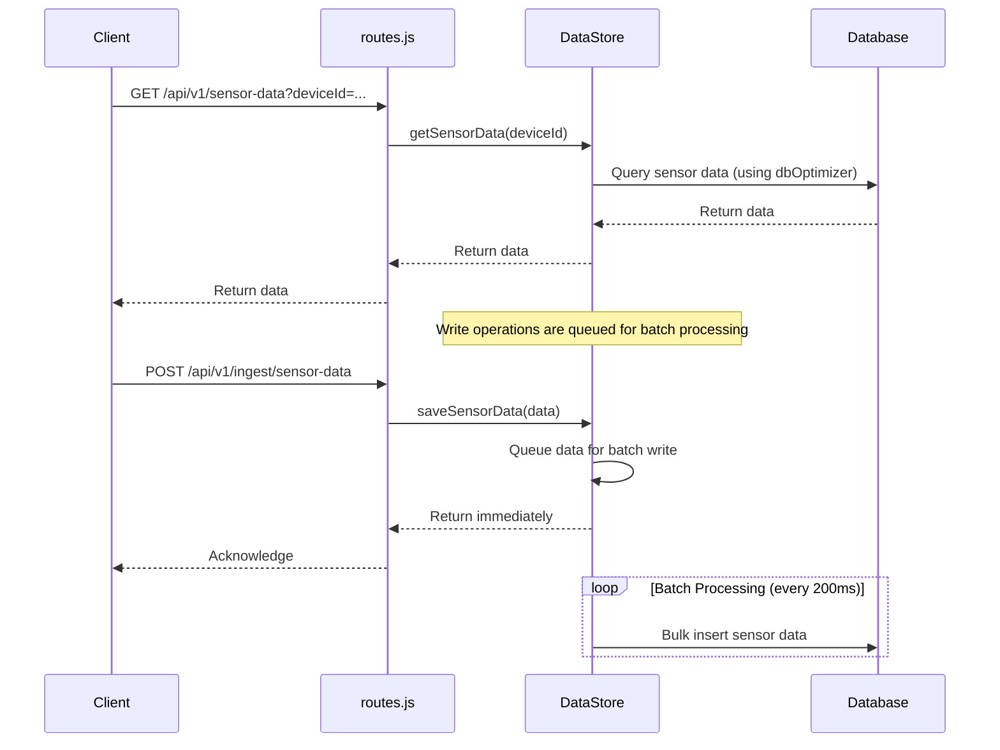

# Plan to Remove Caching and Fix Sensor Data Issue

## Overview
This document outlines the plan to:
1. Remove the caching layer (CacheManager) from the DataStore.
2. Fix the sensor data update issue by ensuring immediate persistence and real-time updates.
3. Optimize database access with indexes and query improvements.

## Implementation Plan

### Phase 1: Remove Caching Layer
1. Remove `CacheManager` references from `dataStore.js`:
   - Delete cache initialization in constructor.
   - Remove all cache read/write operations.
   - Remove cache invalidation methods.

2. Update DataStore methods to use direct database access:
   ```javascript
   // Before (with cache)
   getDevice(deviceId) {
     const cached = this.cacheManager.getCachedDevice(deviceId);
     // ...
   }

   // After (direct access)
   async getDevice(deviceId) {
     return this.dbOptimizer.optimizedFindOne(this.Device, {
       where: { id: deviceId }
     });
   }
   ```

### Phase 2: Fix Sensor Data Flow
1. Modify sensor data saving:
   ```javascript
   async saveSensorData(data) {
     // Immediately persist instead of queueing
     return this.dbOptimizer.optimizedCreate(this.SensorData, data);
   }
   ```

2. Update batch processing to only handle non-critical operations:
   - Keep device updates and buzzer requests batched.
   - Remove sensor data from batch queue.

3. Add real-time notification after sensor data save:
   ```javascript
   // After saving sensor data
   const sensorMessage = {
     type: 'sensor-data-update',
     deviceId: data.deviceId,
     timestamp: Date.now()
   };
   wss.clients.forEach(client => {
     if (client.readyState === WebSocket.OPEN) {
       client.send(JSON.stringify(sensorMessage));
     }
   });
   ```

### Phase 3: Optimize Database Access
1. Add database indexes:
   ```javascript
   // In database initialization
   await queryInterface.addIndex('SensorData', ['deviceId', 'timestamp']);
   ```

2. Implement query optimizations:
   ```javascript
   async getSensorData(deviceId, limit = 100) {
     return this.dbOptimizer.optimizedFindAll(this.SensorData, {
       where: { deviceId },
       order: [['timestamp', 'DESC']],
       limit
     });
   }
   ```

## Mermaid Diagram: Data Flow After Changes


## Expected Outcomes
1. **Caching Removed**:
   - Simpler codebase.
   - Elimination of cache-related bugs.
   - Slightly slower reads but consistent data.

2. **Sensor Data Fixed**:
   - Immediate persistence of sensor data.
   - Real-time updates via WebSocket.
   - Consistent data in GET responses.

## Risks and Mitigation
| Risk | Mitigation |
|------|------------|
| Database load increase | Add rate limiting to sensor data endpoint |
| WebSocket overhead | Use efficient binary protocol (MessagePack) |
| Batch processing gaps | Add flush mechanism for critical operations |

## Next Steps
1. Create detailed implementation tickets.
2. Write migration script for existing cached data.
3. Update API documentation.