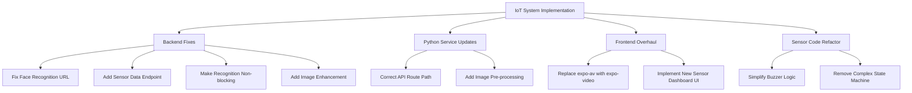

# IoT System Implementation Plan

## Overview
This document outlines the implementation plan for fixing identified issues and enhancing the IoT system based on the analysis of the current codebase. The plan addresses critical API mismatches, performance bottlenecks, and UI improvements across all components.



## 1. Backend Fixes (`iot-backend-express`)
### 1.1 Fix Face Recognition URL
- **File**: `src/dataStore.js`
- **Change**: Update Python service URL to `/api/v1/recognize`
- **Code Change**:
  ```javascript
  // Before
  const recognitionUrl = `${pythonServiceUrl}/recognize`;
  
  // After
  const recognitionUrl = `${pythonServiceUrl}/api/v1/recognize`;
  ```

### 1.2 Add Sensor Data Endpoint
- **File**: `src/routes.js`
- **Change**: Add GET `/api/v1/sensor-data` endpoint
- **Code Change**:
  ```javascript
  app.get('/api/v1/sensor-data', async (req, res) => {
    // Implementation from plan
  });
  ```

### 1.3 Make Recognition Non-blocking
- **File**: `src/routes.js`
- **Change**: Use `setImmediate` for face recognition
- **Code Change**:
  ```javascript
  // Before
  const recognitionResult = await dataStore.performFaceRecognition(req.body);
  
  // After
  setImmediate(() => {
    dataStore.performFaceRecognition(req.body)
      .then(recognitionResult => {
        // Handle result
      });
  });
  ```

### 1.4 Add Image Enhancement
- **File**: `src/routes.js`
- **Change**: Add Sharp library for image enhancement
- **Code Change**:
  ```javascript
  const enhancedBuffer = await sharp(req.file.buffer)
    .jpeg({ quality: 90 })
    .toBuffer();
  ```

## 2. Python Service Updates (`iot-image`)
### 2.1 Correct API Route Path
- **File**: `api_routes.py`
- **Change**: Update route to `/api/v1/recognize`
- **Code Change**:
  ```python
  # Before
  @router.post("/recognize")
  
  # After
  @router.post("/api/v1/recognize")
  ```

### 2.2 Add Image Pre-processing
- **File**: `data_store.py`
- **Change**: Add OpenCV for image enhancement
- **Code Change**:
  ```python
  # Add contrast and brightness adjustment
  img = cv2.convertScaleAbs(img, alpha=1.2, beta=40)
  ```

## 3. Frontend Overhaul (`iot-frontend`)
### 3.1 Replace expo-av with expo-video
- **File**: `app/(tabs)/explore.tsx`
- **Change**: Update video component
- **Code Change**:
  ```typescript
  // Before
  import { Video } from 'expo-av';
  
  // After
  import Video from 'expo-video';
  ```

### 3.2 Implement New Sensor Dashboard UI
- **File**: `app/(tabs)/sensor-data.tsx`
- **Change**: Complete UI overhaul with dynamic charts
- **Implementation**:
  - Use react-native-chart-kit for visualization
  - Add theme-aware styling
  - Implement device selector dropdown

## 4. Sensor Code Refactor (`iot-code-sensors-2ndesp`)
### 4.1 Simplify Buzzer Logic
- **File**: `main/main.ino`
- **Change**: Replace polling with direct command
- **Code Change**:
  ```cpp
  // Before: Complex state machine
  // After: Single beep function
  void activateBuzzer(String requestId) {
    // Simplified implementation
  }
  ```

### 4.2 Remove Complex State Machine
- **File**: `main/main.ino`
- **Change**: Delete unused state variables and logic
- **Code Removal**:
  ```cpp
  // Remove all state machine related variables:
  // - buzzerPattern
  // - patternStep
  // - patternStartTime
  ```

## Implementation Sequence
1. Update backend services
2. Deploy Python service changes
3. Update sensor firmware
4. Deploy frontend updates
5. Verify end-to-end functionality

## Next Steps
1. Implement changes in respective components
2. Create detailed step-by-step markdown files for each change
3. Perform integration testing